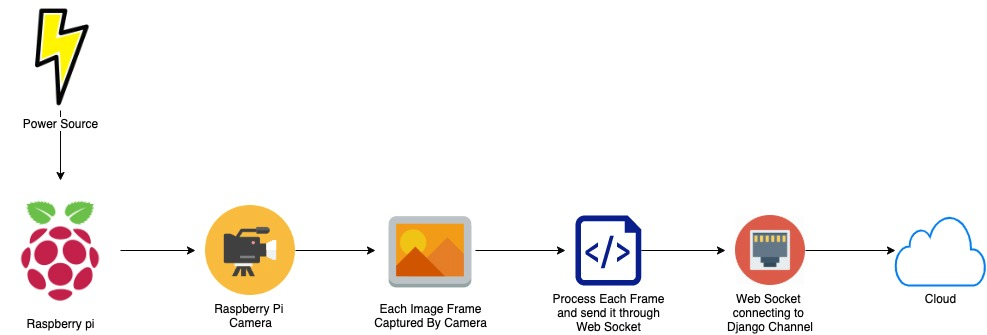
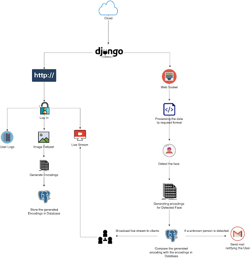

# CAPSTONE 

## Smart Surveillance System

### About:

The goal of the project is to create a home surveillance system which is capable of monitoring, recognizing and responding during intrusion. The system should be capable of processing the video stream at real-time. The system should be user-friendly and should be at an affordable price. The system uses a raspberry pi to capture and process the video stream from the camera.

### System Architecture

### Tool Stack:

- IDE
- Raspberry Pi 4
- Raspberry Pi Camera

### Installation:

- Set up a virtual environment and activate it
- Clone the project and install the packages using,

  `python pip install requirements.txt`

- Create a database in your PostgreSQL
- Create a .env file with NAME, USER, PASSWORD, HOST of the database and your email credentials EMAIL_HOST_USER, EMAIL_HOST_PASSWORD

### Setting up the environment:

- First task, Migrate the django model to PostgreSQL using the following command,

  `python manage.py makemigrations capstone`

  `python manage.py migrate`

- Next, intiate the celery with the following command,

  `python celery -A mysite worker -l info`

- Run the raspberrypi.py script in a new terminal

  `python raspberrypi.py`

- Finally, Run the django server in a another terminal

  `python manage.py runserver`

### System Flow:

- Login/Register into the system with the **/register** or **/login** endpoint
- Then generate the facial encoding of the known people by uploading a minimum of 6 photos per person using the endpoint **/encoding**
- Once the familiar faces are uploaded, The system will be able to diffrentiate between familar faces and a unknown face.
- When a unknown face is detected, the system send a mail with the detected face.

### Endpoints

- /register : To register a account
- /encoding : For generating facial encoding
- /livestream : Viewing the raspberry pi stream
- /log : History of intruder/unknown images

### Future Scope

- [ ] Deploy it in a cloud platform.
- [ ] Improvise the latency.
- [ ] Feature to switch to raspberry storage in case of bad internet connectivity.
- [ ] Feature to detect violent activity such as gun detection, holding a knife in a attacking position.
